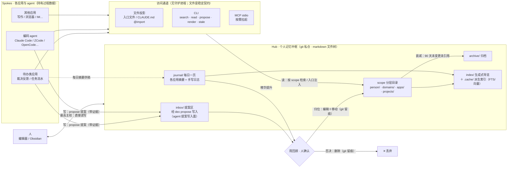
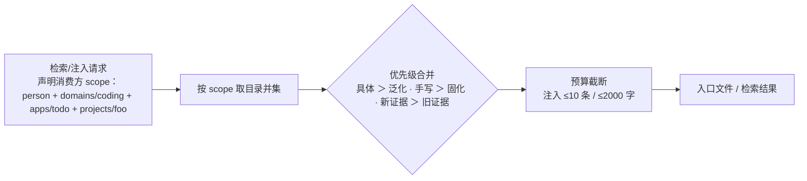
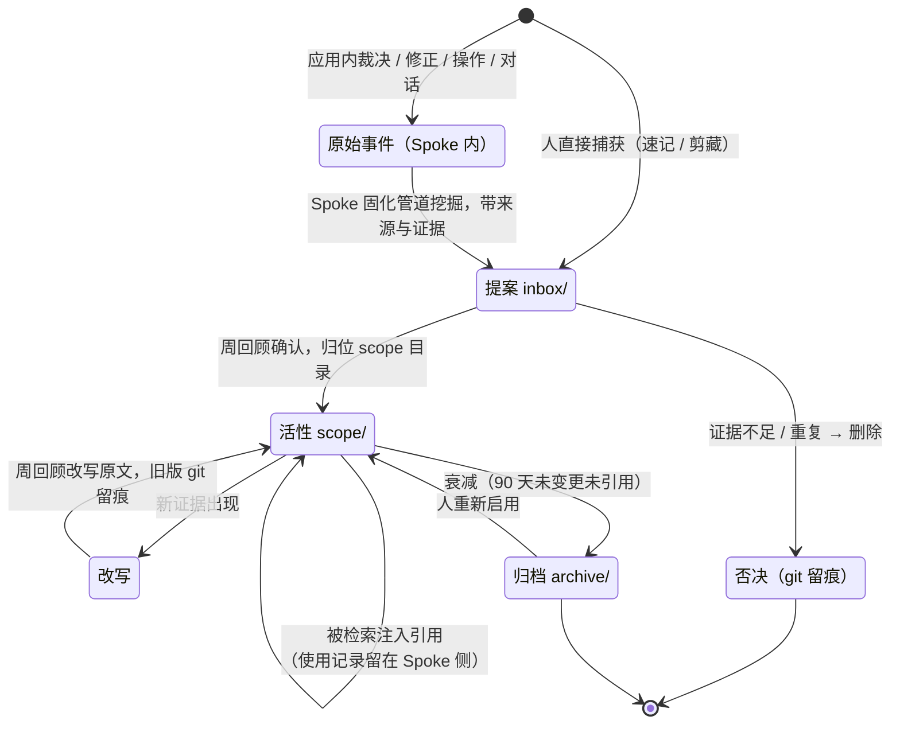
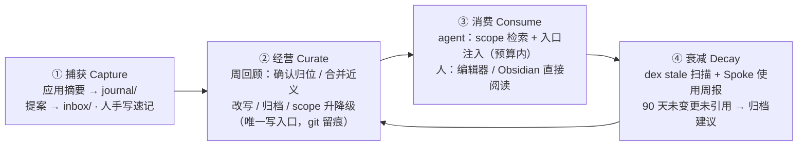

# 个人记忆中枢方案（Hub + Spokes）—— 跨应用的普适记忆与个人知识库

> 目标：① 建立一个**应用无关**的个人记忆中枢（Hub），承载跨项目、跨应用共享的记忆与知识——任何 agent / 应用都能按 scope 接入读取与提案；
> ② 同一棵文件树同时是**个人知识库**：人用编辑器 / Obsidian 直接维护，AI 经 MCP / CLI / 文件投影消费，双向受益；
> ③ 全本地、git 管仓、无守护进程——文件是稳定契约，协议只是适配器。
> 核心分工：**Spoke（各应用/agent）持有过程数据，Hub 只持有结论**。
> 项目命名：**pokemon-remember-you（就记得是你）**——与 pokemon-choose-you（就决定是你了）为姊妹项目，「就决定是你了」负责抓住任务，「就记得是你」负责记住训练家；CLI 二进制名 **dex**（图鉴，兼有 index 双关），数据仓库即「图鉴」`~/dex`，MCP 以 `dex mcp` 子命令随同一二进制分发。
> 调研时间：2026-09-20（增量更新：2026-09-21）。

## 一、要解决的问题

agent 时代，每个人的上下文散落在互不可见的孤岛里：

| 孤岛 | 持有什么 | 问题 |
|---|---|---|
| 编码 agent（Claude Code / ZCode / OpenCode…） | per-project CLAUDE.md、用户级配置、会话摘要 | 记忆绑定单一工具，项目间不共享，换工具即失忆 |
| 各类应用（待办、写作、IM 助手…） | 应用内反馈数据、使用记录 | 教训只在本应用内生效，且多数连本应用也未消费 |
| 个人笔记（Obsidian / Notion…） | 人写知识 | AI 读不到或要专门搭桥；笔记与 agent 记忆是两套系统 |

具体痛点：同一个「我」的事实（偏好、人物关系、项目背景）要在 N 处重复声明；某应用学到的教训（「这个群全是闲聊」）别的 agent 无从知晓；个人笔记沉淀的知识无法进入任何 agent 的上下文。**缺的是一个中立的、应用无关的、人机共用的记忆层。**

## 二、社区调研结论

详细纪要见文末链接。对本方案有直接影响的共识：

1. **需求已被验证，且收敛到「本地 MCP 记忆服务」形态**：Mem0 的 OpenMemory MCP（2025-05）做成了「本地优先、跨 MCP 客户端共享记忆」的服务，证明跨应用共享记忆是真实需求；但它走自建服务栈与私有存储，人不能直接维护记忆内容。
2. **文件即知识是另一条主线**：Basic Memory 把知识库做成「磁盘上的 markdown + MCP 工具（search/read/write）+ 轻量知识图谱」，人与 AI 双向编辑同一份文件；Anthropic 官方 memory tool 同样是「记忆文件目录 + CRUD 工具」。**启发**：文件形态对人最友好、对工具最中立；**教训**：frontmatter/图谱结构越重，维护成本越高。
3. **scope 分层有成熟先例**：Claude Code 的 CLAUDE.md 层级（企业/项目/用户三级 + `@import` 引用）本质就是「按覆盖范围分层的记忆 + 合并优先级」；AGENTS.md 正在成为跨工具的入口文件约定。把它从「一个编码工具的约定」泛化为「个人中枢的 scope 模型」即可。
4. **同一个 vault 人机共用是可行日常**：Obsidian + MCP 的社区实践（混合检索：关键词 + 语义；plain text 作为长寿格式）验证了「一个仓库既给人用又给 agent 用」的形态已经跑通。
5. **个人 KB 的历史教训是分类法腐化**：PARA / Zettelkasten / 重标签体系普遍经验——schema 越重烂得越快。Hub 的强制结构必须克制：**目录即 scope 是唯一强制结构**，导览靠生成式索引。
6. **固化/治理模式沿用记忆领域共识**（Mem0 的提案归并、确认门、定期体检）：Hub 的写入必须是「提案 → 人确认 → 归位」，agent 永远不能直写 scope 目录。
7. **「文件 + git」已收敛为主流形态**（2026-09-21 增量调研）：Letta Context Repositories（2026-02）把编码 agent 记忆重建为 git 版本化文件系统（提交/分支/合并，「treat context like source code」）；Accenture 开源 agent-memory（Mercury 家族）——git 提交的 `memory/` 目录 + 纯 markdown + 任意 vendor 读写，是本方案最接近的先例，但为**团队向、agent 可直写**。dex 的差异化正在于此：单人、propose-only、目录即 scope、注入有预算。同期 Claude Code 上线 auto memory（`~/.claude/projects/<repo>/memory/`，MEMORY.md 索引仅加载前 200 行/25KB，per-project 机器本地）——按 Hub/Spoke 分工属 Spoke 过程数据：可禁用（`autoMemoryEnabled: false`）或并存并定期收割进 Hub（见需求 US-12）。
8. **入口文件事实标准是 AGENTS.md**：20–30+ 工具读取（Codex CLI / Cursor / Gemini CLI / Aider / Zed / Jules…），通行做法是以 AGENTS.md 为源、各工具入口同步或 symlink。注意 Claude Code 仅在工作区及上级均无 CLAUDE.md 时才读 AGENTS.md——其消费方优先 `@import`，或生成一行 `CLAUDE.md` shim（`@AGENTS.md`）。
9. **记忆安全成为独立威胁类别**（memory poisoning：MINJA / AgentPoison 等）：agent 写入的记忆正文本身可携带注入指令，沉淀后会被注入所有消费方。社区共识缓解：密钥守卫（pre-commit 正则拦截凭证）、写时矛盾检查（禁止静默裁决，显式 supersede）、注入内容标注为数据而非指令。Hub 的人审确认门是第一道也是最硬的防线，另在 render 产物标注与密钥扫描上补内容层防御（见设计 §10）。
10. **配套技能（skills）是行为层标配**：Accenture agent-memory 以 `agent-skills/<name>/SKILL.md` 为 vendor-neutral 单一源、各工具目录只放生成的薄适配器（gitignore，永不手维护副本）；Claude Code / ZCode / OpenCode 均已支持 SKILL.md 格式。协议（MCP/CLI）定义 agent 能做什么，技能定义该怎么表现——dex 的面试、收割、周回顾等行为以技能形态分发（见 §七）。

## 三、设计原则

1. **Hub 持有结论，Spoke 持有过程**：候选池、置信度计数、审计、原始反馈留在各应用内；只有确认后「值得活过三个月的结论」才进 Hub。判据：这条记忆换一个应用还成立吗？
2. **文件是稳定契约，协议是适配器**：事实源是 git 管理的 markdown 文件树；MCP / CLI / 入口渲染都只是访问通道，可替换。协议生态年轻，文件不会过时。
3. **目录即 scope**：不建路由表、不做本体论。`person/ ⊃ domains/ ⊃ apps/ projects/` 的目录层级承担全部路由语义。
4. **写入主权分级**：人直接编辑（最高）＞ 周回顾确认的固化归位 ＞ agent 写 `inbox/` 提案（唯一机器可写位置）。一切变更经 git 留痕。
5. **消费有预算**：任何注入都过 scope 过滤 + 条数/字数预算 + 优先级合并（具体＞泛化、手写＞固化、新证据＞旧证据）。
6. **无守护进程**：v0/v1 靠文件与 CLI；MCP 用 stdio 按需拉起。派生索引（FTS/向量）存 `.cache/`，每机可重建，不进 git。

## 四、总体架构



| 角色 | 持有 | 不持有 |
|---|---|---|
| Hub | 确认后的记忆与知识、每日一页、提案区、归档 | 候选计数、审计流水、原始反馈、应用运营状态 |
| Spoke | 各自的过程数据（反馈、流水、候选池） | 跨应用共享的结论（确认后交Hub） |

## 五、Hub 的组织：目录即 scope

```text
~/dex/                             # 「图鉴」——git 私仓（路径自定，示例 ~/dex）；同一棵树即 Obsidian vault
├── person/                         # 个人层：全应用默认可见——只放愿意让全部消费方看到的通用自我事实
│   ├── profile.md                  #   我是谁、做什么、机器不可推断的长期事实
│   └── preferences.md              #   稳定偏好（写作风格、沟通习惯、常用格式）
├── domains/                        # 领域层：按主题分域，分法是用户约定（无内置语义）
│   ├── coding/                     #   示例：开发模式域——技术栈、开发偏好（升降级高频去向，需求 §3.7）
│   └── people/李四.md              #   人物页：关系、背景、沟通偏好（第一人称，只存「我与某人的关系」）
├── apps/<app>/                     # 应用层：某应用专属的记忆（如待办判定模式）
├── projects/<project>/             # 项目层：个人的项目记忆（我的视角/例外/踩坑；团队指令归 repo 的 CLAUDE.md，dex 只收编散落的个人性内容）
├── journal/2026-09-20.md           # 情景层：每日一页，各应用摘要 + 手写日志汇流
├── inbox/                          # 提案区：agent 提案写入面（经 dex propose，带来源与证据）；journal 供稿小节为第二写入面（FR-5.4）
├── archive/                        # 归档：保留原文，不再注入
├── index/                          # 生成式导览（MOC）：由工具生成，不手维护
└── .cache/                         # 派生索引（FTS/向量），gitignore，每机重建
```

**scope 合并与注入规则**（图示）：



- 消费方声明自己是谁（哪类应用、哪个项目），据此决定 `domains/`、`apps/`、`projects/` 哪些目录进入并集；`person/` 恒在。
- 具体压过泛化：项目级事实与个人层冲突时，注入项目级并注明来源；手写内容压过一切固化内容。
- 同一事实多处出现是**允许的冗余**（方便局部阅读），以 git 最近改写为准，周回顾时合并。

**条目格式（刻意克制）**：scope 内文件按主题一文件、一条一个要点，不加 frontmatter；来源追溯用 HTML 注释，人读不干扰：

```markdown
# 偏好
- 周报类任务多在周四下午被提到，标题习惯「写周报-MM/DD」
- 中文写作避免「进行」「予以」一类冗词
<!-- src: choose-you 固化 2026-09 · 证据×6 -->
```

被新结论推翻的旧条目由人标注 `<!-- superseded-by: <新条目位置> -->`，不再参与注入——矛盾显式化，禁止静默裁决（见需求 FR-2.5）。

**结构稳定性原则**（目录是消费方声明的 API——render 配置、MCP 白名单、`@import` 引用都指向它，稳定性即契约问题）：

- **先内容后结构**：不建空目录；同类条目 ≥10 且连续两周进入回顾清单才建新域——目录是被内容逼出来的，不是预设出来的；
- **结构不变量机检**：顶层目录白名单、命名/深度规则、目录软预算（`domains/` 一级 ≤8）由 `dex lint` 断言；
- **变更走协议**：目录改名 = `git mv` + 同步配置与 `@import` 引用 + 提交留痕，低频执行；
- **深度组织外包给检索**：目录只承载 scope 语义这一个职责，导航与聚合靠 `index/` 生成导览与检索——职责单一，才烂得慢。

## 六、记忆与知识的生命周期



要点：

- **提案即文件**：Spoke 的固化管道（或 agent 本人）产出提案文件落 `inbox/`，轻 frontmatter（source / kind / confidence / evidence）；确认时人编辑内容、剥掉元数据、移动到目标 scope——`git mv` 即确认动作，历史即审计。
- **使用记录不写回 Hub**：注入命中计数留在各 Spoke（它们本来就有过程数据），避免 Hub 文件被高频改写；衰减信号由两部分组成——`dex stale` 按 git log 扫「最后实质变更 ≥90 天」的条目 + 各 Spoke 周报汇总的引用情况，周回顾人审裁决。
- **遗忘不删除历史**：否决、归档、改写旧版全部活在 git 历史里，`archive/` 只是「不再注入」的显式标记。

## 七、访问通道与写入协议

三条通道定位互补，覆盖从「零工具接入」到「深度集成」：

| 通道 | 定位 | 接入方式 |
|---|---|---|
| 文件投影 | 零依赖底线 | `dex render <agent>` 把「该消费方 scope 的合并视图」渲染成入口文件（默认名 `AGENTS.md`，跨工具事实标准）放进其工作区；Claude Code 仅在工作区无 CLAUDE.md 时才读 AGENTS.md，故其消费方优先 `@import`——`~/.claude/CLAUDE.md` 里 `@~/dex/person/profile.md` 等引用即全局生效，项目级 `.claude/CLAUDE.md` 引 `projects/<proj>/`。注意：仓库外路径首次 import 会弹一次确认框；import 启动即全量加载、不省 context，条目变多后注入预算改由 `dex render` 承担 |
| CLI | 应用与脚本集成 | `dex search <q> [--scope …]`（v1 用 ripgrep，v2 走派生索引）、`dex read`、`dex propose`（stdin 提案）、`dex render`、`dex stale`、`dex reindex`、`dex review`（生成周回顾清单） |
| MCP stdio | 通用 agent 生态 | 工具面只四类：`dex_search` / `dex_read` / `dex_propose` / `dex_journal`（journal 供稿，FR-5.4）——**没有直写 scope 的工具**；以 `dex mcp` 子命令随同一二进制分发，按需拉起，无常驻进程 |

**配套技能（行为层，v0 起以纯 markdown 分发）**：协议定义 agent 能做什么，技能定义该怎么表现。本仓 `skills/` 为单一源（一技能一目录 + SKILL.md），v0 经 symlink 接入 Claude Code / ZCode / OpenCode；异构格式（Cursor rules 等）由 `dex render --skills` 生成薄适配器（FR-11.4，产物 gitignore）。最小技能集三个：

| 技能 | 职责 |
|---|---|
| `dex-bootstrap` | 零手写冷启动执行者：面试 5 核心问题 + 扫描既有 CLAUDE.md / AGENTS.md / auto memory，草稿全部落 `inbox/bootstrap/`，逐条标源，首批 ≤30 条、confidence 降序 |
| `dex-propose` | 日常提案纪律：入库判据「换一个应用还成立吗」、evidence 必填、scope 路由建议——防提案洪水的第一道软防线 |
| `dex-review` | 周回顾执行者：七段清单走查 + 建议命令；v0 为纯 checklist，v1 起内嵌 `dex review` 调用 |

行为来自用户安装的技能（可信通道），记忆内容永远是数据（不可信通道，受「数据非指令」约束）——行为与数据分离，记忆投毒只能冒充数据、冒充不了行为指令。

**连接器层（数据获取，FR-12）**：获取外部数据不内建 fetcher 适配器——首选来源自身 CLI（认证由 CLI 自管，dex 零 token 托管）、本地数据经 Bash/文件读取；每来源的知识以一页「连接器页」承载（`skills/connectors/`，六要素模板），agent 在收割技能驱动下按需拉取 → 蒸馏（三判据 + 隐私红线）→ `dex propose` 入 inbox。agentic 收割受三道缰绳约束：预算硬上限、完成判据清单化（四象限覆盖）、拉取内容一律当数据。连接层三形态：连接器页（一次性收割）、收割脚本（周期 digest）、外部 Spoke（常驻应用）——统一注册、写入收敛于 `dex propose`；**扩展点的稳定性靠协议不靠 ABI**，不引入 in-process 插件机制（取舍见设计 §13）。模板与接入五步清单见设计 §5.7。

**inbox 提案格式**（机器写，人读，周回顾消费）：

```markdown
---
source: choose-you          # 来源应用 / agent
kind: pattern               # fact / preference / pattern
confidence: 85
evidence: chat_feedback #1234 #1301 #1355
---
群聊「摸鱼俱乐部」的消息全为闲聊，对该用户无待办含义
```

提案必须带证据；无证据的提案在周回顾中直接否决。`inbox/` 周清空——要么归位要么删除，不允许堆积成第二个待办清单。

**journal 每日一页**（人与各应用共同供稿的情景层）：

```markdown
# 2026-09-20
## 供稿 · choose-you
- 捕捉 3 / 逃走 2（原因码：闲聊×2）
## 手写
- 今天定了个人记忆中枢的方案；周报改为周四下午处理
```

每日页由各应用自动摘要 + 人随手补写；周回顾从中「提升」值得长期保留的事实进 scope，其余留在 journal 作为自然衰减的情景记录。

## 八、个人知识库的维护循环

**冷启动（零手写）**：启动阶段只用写入主权分级的下两档——agent 起草、人裁决，制度性消灭「新建文件从零写」这个动作（手写降为可选的最高主权，随时可用）。两个内容源：① **挖掘**（用户成本 ≈ 0）：既有 CLAUDE.md / AGENTS.md / .cursorrules、auto memory 存量、历史会话转录 → 蒸馏候选进 inbox；② **面试**（成本 = 聊天）：首轮 5 个核心问题当天可用，其余由 agent 在后续会话渐进补问。行为由 `dex-bootstrap` 技能承载（见 §七），贴提示词仅为不支持技能工具的兜底（附录模板）。



周回顾（每周一次，15 分钟量级）是整个系统唯一的知识写入口，操作集固定：

1. **清 inbox**：逐条 确认归位 / 编辑后归位 / 否决；
2. **提 journal**：从本周每日页提取值得长期保留的事实；
3. **处理衰减清单**：`dex stale` 输出 + Spoke 使用周报 → 归档 / 改写 / 保留；
4. **scope 升降级**：某条应用记忆发现跨应用成立 → 上提 `domains/` 或 `person/`；反之下降；
5. **合并冗余与矛盾**：`index/` 工具预筛的近义条目（字符串相似度预筛，人裁决）；确认被推翻的旧条目加 `superseded-by` 注释而非静默删除，不再注入。
6. **结构整理**：lint 结构体检驱动（目录软预算 / 待拆分大文件 / 孤儿目录 / 悬空 scope 引用）——目录增删改名（走 scope 改名协议）、文件拆并。

## 九、多机同步、隐私与信任边界

- **多机同步 = git**：私有仓库（自托管或平台私库）。Hub 写入低频（周回顾为主）、条目原子、纯文本——merge 友好；`.cache/` 每机重建。冲突罕见且即内容问题，人解决。
- **git 历史的双刃**：永久留痕既是审计能力也是脱敏负担——敏感内容（凭证、他人隐私）不入 Hub；确有需要时整仓加密工具（如 git-crypt）。
- **信任分级**：所有 agent 一律 propose-only；只有「人 + 各 Spoke 的固化管道（其内部另有确认门）」能把结论送进 scope。远程/第三方 agent 只能拿到声明的 scope 子集。
- **分域约定与最小授权**：分域方式（如工作/生活）是用户级约定，工具不内置分域语义（P3，需求 FR-3.7）；授权遵循最小化——按消费方实际需要授予 scope 子集、默认全拒；示例分法、来源接入地图与组合建议见 [WORK_LIFE_SCENARIOS.md](./WORK_LIFE_SCENARIOS.md)。
- **完全本地**：无云依赖、无遥测；Obsidian、编辑器、grep 都是合法客户端。

## 十、分期落地

| 期 | 内容 | 量级 |
|---|---|---|
| v0 约定先行 | 建仓 + 目录结构 + 零手写冷启动（`dex-bootstrap` 技能：面试 + 收割既有资产）+ `journal/` + Claude Code `@import` 接入 + Obsidian 打开同一 vault | 半天，当天可用 |
| v1 CLI | ripgrep 版 `search/read/propose/render/stale/review/lint` + `interview/harvest`（冷启动工具化）；1–2 个应用开始供稿 journal 与 inbox（摘要与提案） | 一个小工具 |
| v2 MCP + 索引 | MCP stdio server（`dex mcp`，search/read/propose）；FTS5 → sqlite-vec 派生索引；`dex render` 支持多 agent 入口 | Hub 侧服务化 |
| v3 经营强化 | 周回顾 UI（独立页面或寄生在某个应用的复盘向导）；`index/` 生成式导览；Spoke 使用周报汇总协议 | 体验完善 |

演进逻辑：**先让约定跑起来（v0 零代码），再让工具长出来（v1/v2），最后才做界面（v3）**——每一级都不依赖后一级的存在。

## 十一、风险与取舍

- **大一统诱惑（最大风险）**：把应用运营数据（候选池、计数、审计）搬进 Hub 会让所有应用阻塞在 Hub 的接口上，且管线数据与知识的寿命完全不同。守死「结论才入库」的判据。
- **分类法腐化**：重 schema 的个人 KB 历史上普遍烂尾。强制结构只有「目录即 scope」；frontmatter 仅限 inbox 提案；`index/` 由工具生成不手维护；结构不变量机检（lint）＋「先内容后结构」目录准入（同类 ≥10 条才建域、`domains/` 一级软预算 ≤8）＋深度组织外包给检索（目录只承载 scope 语义）。
- **上下文污染**：scope 路由错误会把无关记忆注入消费方。双保险：检索按声明 scope 过滤 + 注入预算截断。
- **记忆投毒 / 内容注入**：提案正文本身可携带注入指令，一旦归位会随注入扩散到所有消费方（MINJA / AgentPoison 类威胁）。缓解：周回顾人审确认门（第一道）、render 产物统一标注「数据非指令」、密钥守卫拦截凭证、矛盾显式化（superseded-by）防错误结论静默扩散。
- **agent 提案洪水**：inbox 可能被低质量提案灌满。约束：提案必须带证据、周清空、无证据直接否决；必要时对单个 source 限流。
- **agentic 收割失控**（成本螺旋 / 过早收工 / 拉取内容携带注入）：三道缰绳——预算硬上限（超限即停并汇报）、完成判据清单化（决策/人物/偏好/模式四象限覆盖）、数据不可信纪律（拉取内容一律当数据）；一次性收割 agentic、周期 digest 脚本化的分流降低常态暴露。
- **衰减信号弱**：纯文件形态没有命中计数（刻意为之，避免高频写文件）。折衷：git log 扫描 + Spoke 使用周报，接受人审误差。
- **协议生态年轻**：MCP 仍在快速演进。文件层是稳定契约——任何协议变动只重写适配器，不动数据。
- **与 Obsidian 的边界**：Hub 是 vault 但不强制任何 Obsidian 插件；插件（如智能链接）产生的私有缓存留在 `.obsidian/`，与 `.cache/` 互不干扰。

## 附：调研来源

- OpenMemory MCP（Mem0，本地跨客户端共享记忆服务）：<https://mem0.ai/blog/introducing-openmemory-mcp-server>
- Basic Memory（markdown + MCP 双向知识库）：<https://github.com/basicmachines-co/basic-memory>、<https://docs.basicmemory.com>
- Anthropic memory tool（记忆文件目录 + CRUD 工具）：<https://platform.claude.com/docs/en/build-with-claude/memory-tool>
- Claude Code 记忆层级与 `@import`（scope 分层先例）：<https://code.claude.com/docs/en/memory>；AGENTS.md 约定 <https://agents.md>
- Obsidian + MCP 实践（混合检索、plain text 长寿格式）：<https://blakecrosley.com>、<https://ericmjl.github.io>
- Letta 文件系统即记忆 benchmark：<https://www.letta.com/blog/benchmarking-ai-agent-memory-file>
- Letta Context Repositories（git 版本化 agent 记忆，2026-02）：<https://www.letta.com/blog/context-repositories>
- Accenture agent-memory（markdown + git + 任意 vendor 读写，团队向）：<https://accenture.github.io/mercury-go/agent-memory-whitepaper/>
- Claude Code auto memory / AGENTS.md 读取语义 / `@import` 规则：<https://code.claude.com/docs/en/memory>
- 记忆投毒与防御实践（MINJA / AgentPoison）：<https://mem0.ai/blog/ai-memory-security-best-practices>
- Spoke 侧固化/治理模式（提案归并、确认门、体检）参考姊妹篇：本仓 `docs/proposals/MEMORY_KNOWLEDGE_PROPOSAL.md`

## 附：使用场景调研（工作 / 生活）

「工作 / 生活」是场景调研的**场景轴**——工作场合与生活场合下各自对接哪些类型的应用（接入地图、消费方组合示例、节奏建议），属使用指南而非工具语义；分域粒度是独立的用户决策（P3：工具不内置分域本体，需求 FR-3.7）。统一见 [WORK_LIFE_SCENARIOS.md](./WORK_LIFE_SCENARIOS.md)。

## 附：v0 冷启动引导词（兜底模板）

> 主路径是 `dex-bootstrap` 技能（FR-11）；本模板用于不支持技能安装的工具/场景。

```text
你是我的记忆库引导助手。第一步，采访我：依次问我对所有 agent 通用的 5 个核心问题
（我的角色与主业／主力技术栈与工具／语言与沟通偏好／硬性禁区／常用输出格式），
一次一个，追问到能落成具体条目为止。第二步，把我的回答逐条整理成
person/profile.md 与 person/preferences.md 草稿——每条必须来自我的原话，
不得推断我没有说的内容，并在每条尾部加 <!-- src: bootstrap-interview 日期 -->。
第三步，扫描我指定的既有 CLAUDE.md／AGENTS.md，把仍成立且属于我个人的条目
（非团队指令）整理成对应 projects/<proj>/ 草稿，同样逐条标源。
全部产出写入 ~/dex/inbox/bootstrap/，等我审——不要写任何 scope 目录。
首批不超过 30 条，按你的置信度降序。
```
