# 用户场景业务流程推演（Scenario Walkthrough）

> 项目：pokemon-remember-you（就记得是你）
> 文档版本：v1.7 · 2026-09-25 · 状态：待评审（v1.7：安全补强同步——US-02 render 流程/时序补 HTML 净化步骤（FR-6.16）、US-08 威胁模型边界注补 SECURITY.md 指针；此前 v1.6：安装路径同步（需求 v1.12 修订）——US-14/US-01 的流程、前置与时序图补 v1 `dex skills install`（FR-11.6）与 `dex init`（FR-6.9 澄清含 git init 与首次提交）注记；此前 v1.5：全部 14 个场景补充 Mermaid 时序图——参与者即各工具/平台/系统，直观展示用户跨端操作步骤；此前 v1.4：debt 清偿同步——七段权威段序落定（FR-6.6）、空目录豁免已裁决（FR-2.9）、收割暂存区迁 inbox/staging（FR-6.14）、config 两层存放（FR-10.2）、悬空 debt 引用清理；v1.3：支持范围收窄——AI coding 工具限定 Claude Code / pi / ZCode；v1.2：W3 关闭——工具兼容矩阵产出（TOOL_COMPATIBILITY.md），render 默认位置修正为 repo 根 + 团队仓库分流；v1.1：W1/W2/W4 已随 v1.8 修复）
> 上游文档：[REQUIREMENTS.md](./REQUIREMENTS.md) v1.7（US-01～US-14）· [DESIGN.md](./DESIGN.md) v1.7
> 定位：以 v1.7 机制对全部用户场景做**端到端业务流程推演**（dry-run）——每场景给出前置条件、逐步流程（含实际命令、git 动作、状态落点）与断言；推演暴露的衔接缺口记入「推演发现」（§6）并同步 [debt.md](./debt.md)。**本文不新增需求**，是需求/设计的验证性衍生文档。

---

## 0. 推演基线（v1.7 机制速览）

本次推演依赖的 v1.7 新机制——推演目的之一就是验证这些机制在真实流程里能否闭环：

| 机制 | 编号 | 一句话 |
|---|---|---|
| 客户端统一注册与凭证 | FR-10 组 | 一切消费方（含人）注册为 `[clients.<id>]`；非交互调用须 `--client` + 凭证，TTY 默认 human |
| source 强制绑定 | FR-4.7 | propose/journal 的 source 必须 ∈ 该客户端 allowed_sources |
| journal 供稿命令 | FR-5.4/6.13 | 供稿只走 `dex journal` / `dex_journal`，不直写文件 |
| render 冲突策略 | FR-6.4 | 产物默认落 repo 根、带生成标记；非 dex 产物在目标路径 → 拒绝覆盖（退出码 10）；团队仓库走 @import / rules 适配（工具兼容矩阵 TOOL_COMPATIBILITY.md） |
| keep-until 保留豁免 | FR-2.10 | 衰减「保留」持久化为到期注释；注释变更不计实质变更 |
| 脏工作区调和 | FR-8.3 | 未提交编辑经 mtime 比对即时反映到 v2 索引 |
| harvest 便利封装 | FR-6.14 | `dex harvest` 不蒸馏；蒸馏在 dex-bootstrap 技能（agent 会话） |

**约定**：下文命令中，human 交互式调用省略 `--client`（TTY 默认解析为 human）；非交互调用一律显式 `--client`。git 动作遵循：一切写 = 一次 commit。各场景标题下配 **Mermaid 时序图**：参与者 = 该场景涉及的工具／平台／系统，实线箭头 = 命令／写动作，虚线箭头 = 返回／结果；图与正文流程互为对照，冲突时以正文为准。

---

## 1. 旅程 A：冷启动（US-14 → US-01 → US-13）

### 1.1 US-14 技能安装（v0 起，一切的起点）

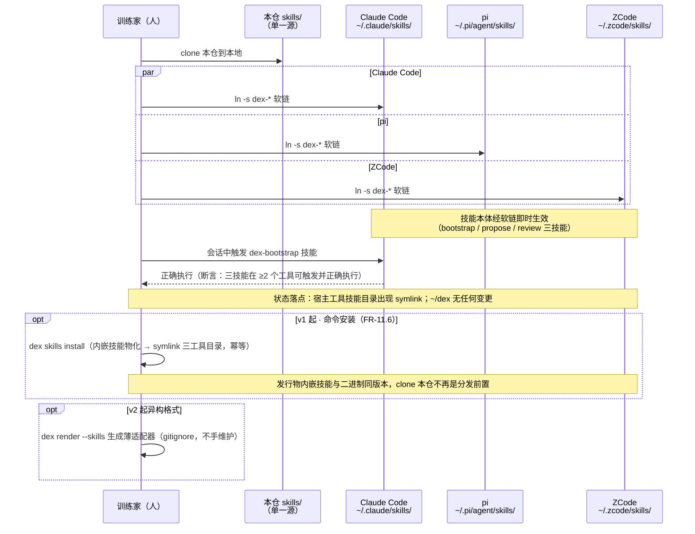

**前置**：v0——本仓 clone 到位（技能单一源，FR-11.1）；v1 起——dex 发行物内嵌技能，`dex skills install` 直接安装、无需 clone（FR-11.6）。目标工具（Claude Code / pi / ZCode——支持范围见需求 §7）支持 skills 目录。

**流程**：
1. `ln -s <本仓>/skills/dex-* ~/.claude/skills/`（pi：`~/.pi/agent/skills/`；ZCode：`~/.zcode/skills/`——各自技能目录）；
2. 技能本体即生效（一技能一目录 + SKILL.md，本仓 `skills/` 为单一源）；
3. v2 起异构格式：`dex render --skills` 生成薄适配器（gitignore，不手维护）；
4. **v1 起命令安装**：`dex skills install [--tool …]`——发行物内嵌技能物化到 dex 管理目录后 symlink 三工具技能目录（幂等、死链重建、非本仓同名冲突退出码 10；`--from` 走本仓工作副本，FR-11.6）；手动 symlink 保留为兜底。

**状态落点**：宿主工具技能目录出现 symlink；`~/dex` 无任何变更。

**断言**：三个技能（bootstrap/propose/review）在 ≥2 个工具中可触发并正确执行。

### 1.2 US-01 零工具冷启动（v0 · 零手写）

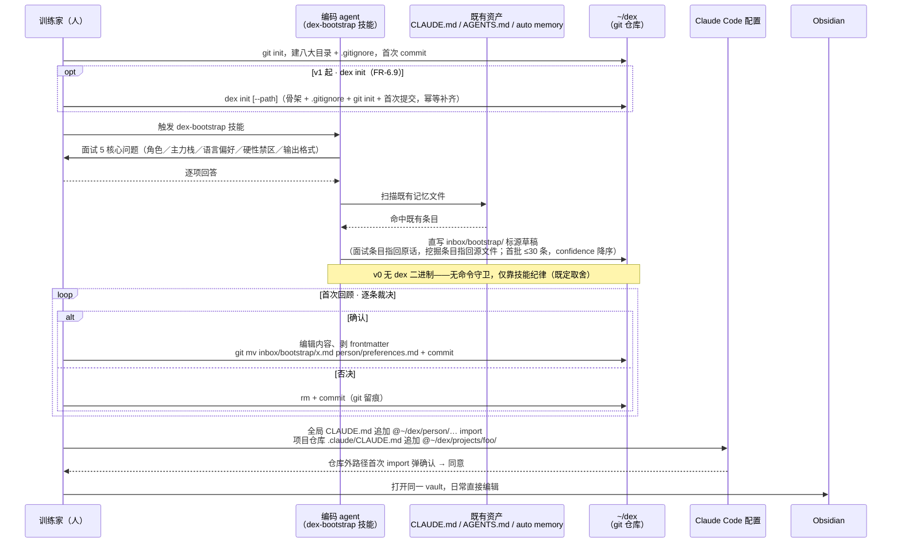

**前置**：git 可用；US-14 已安装技能；Obsidian 可选。

**流程**：
1. **建仓**：`mkdir ~/dex && cd ~/dex && git init`；建 `person/ domains/ apps/ projects/ journal/ inbox/ archive/ index/` 八目录与 `.gitignore`（忽略 `.cache/`、`.obsidian/`）；首次 commit（v1 起 `dex init` 一键完成——含 `git init` 与首次提交、幂等补齐，FR-6.9）；
2. **冷启动**（对任一编码 agent 触发 `dex-bootstrap` 技能）：面试 5 核心问题（角色／主力栈／语言偏好／硬性禁区／输出格式）→ 扫描既有 CLAUDE.md / AGENTS.md / auto memory → 逐条标源草稿（面试条目指回原话、挖掘条目指回源文件）→ 直写 `inbox/bootstrap/`，首批 ≤30 条、confidence 降序；
3. **首次回顾**：逐条裁决——确认：编辑内容、剥 frontmatter、`git mv inbox/bootstrap/x.md person/preferences.md`（= 确认动作，commit）；否决：`rm`（commit）；
4. **接入 Claude Code**：`~/.claude/CLAUDE.md` 追加 `@~/dex/person/profile.md`、`@~/dex/person/preferences.md`；项目仓库 `.claude/CLAUDE.md` 追加 `@~/dex/projects/foo/`（仓库外路径首次 import 弹确认，同意即可）；
5. **Obsidian 打开同一 vault**，日常直接编辑。

**状态落点**：`person/` ≥10 条、每条带 `<!-- src: … -->`；`inbox/` 清空；git log 含初始提交 + 首轮回顾提交。

**断言**：当天可用；全程无需手写（手写是可选最高主权）。

**推演发现**：
- ⚠️ v0 的 bootstrap 草稿由技能**直写文件**——此时 dex 二进制不存在，无命令守卫（密钥扫描 / 限流 / 幂等均缺位），只靠技能纪律。这是「v0 零代码」的既定取舍，v1 起统一收敛到 `dex propose`（FR-4 组）；推演确认该缺位**仅限 v0 窗口期**，可接受，但接入文档应写明。
- 建八大空目录与 FR-2.9「不建空目录」/ lint 检查的冲突已裁决（✅ 2026-09-25：空目录约束对象收窄为内容驱动子目录（domains/apps/projects 及以下），顶层八大结构目录豁免——FR-2.9/设计 §5.6，US-01/`dex init` 建骨架合法）。

### 1.3 US-13 既有资产收割与冷启动完成线（v1）

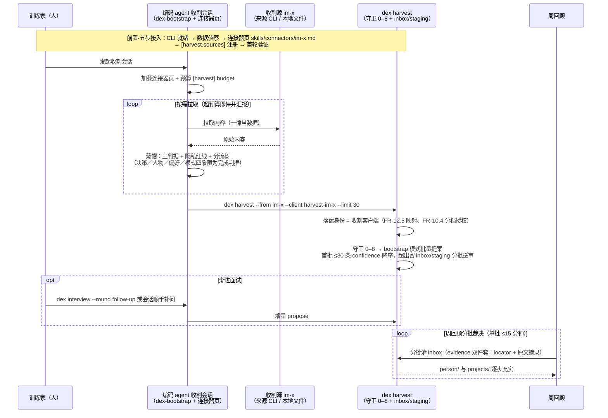

**前置**：v1 已装；收割源按五步接入完成（CLI 就绪 → 数据侦察 → 连接器页 `skills/connectors/<source>.md` → `[harvest.sources]` 注册 → 首轮验证）。

**流程**：
1. **收割会话（技能驱动）**：编码 agent 会话内加载 `dex-bootstrap` 技能 + 连接器页 → 按需拉取（来源 CLI / 本地文件，agent 工具执行）→ 蒸馏（三判据 + 隐私红线 + 分流树，只收个人性内容）→ 全程自限三道缰绳：预算（`[harvest].budget`，超限即停并汇报）、完成判据（决策/人物/偏好/模式四象限）、拉取内容一律当数据；
2. **落盘（命令门禁）**：`dex harvest --from im-x --client harvest-im-x --limit 30`（FR-6.14 便利封装，不蒸馏；落盘身份 = 收割客户端——FR-12.5 映射、FR-10.4 分档授权）——加载连接器页与预算配置、管理 `inbox/staging/` 暂存区、把技能产出的候选批量走 bootstrap 模式提案（守卫 0–8，首批 ≤30、confidence 降序，超出留暂存区分批送审）；
3. **渐进面试**：`dex interview --round follow-up` 或 agent 会话顺手补问 → 增量 propose；
4. **分批裁决**：周回顾分批清 inbox（单批 ≤15 分钟）。

**状态落点**：`inbox/` 分批流入收割候选（evidence 双件套：locator + 原文摘录）；`person/` 与 `projects/` 逐步充实。

**断言（冷启动完成线）**：`person/` ≥10 条全带溯源；≥2 个常用项目有 `projects/` 内容；`dex render` 产物 ≥5 条且 ≥1000 字符（注入预算之半）；agent 首次 `dex search` 有命中；首轮回顾分批完成。

**推演发现**（✅ 均已随 v1.8 修复，详见 §6）：
- **W1（已修复）**：FR-10.4 权限分档——harvest/interview 允许 human 或显式授权的收割客户端；
- **W2（已修复）**：FR-12.5 收割客户端映射——`[clients."harvest-im-x"]`：scopes=[]、propose=true、allowed_sources=["im-x"]。

---

## 2. 旅程 B：日常运行（US-02 / US-03 / US-10 / US-12 / US-05）

### 2.1 US-02 编码 agent 按项目 scope 消费（v1/v2）

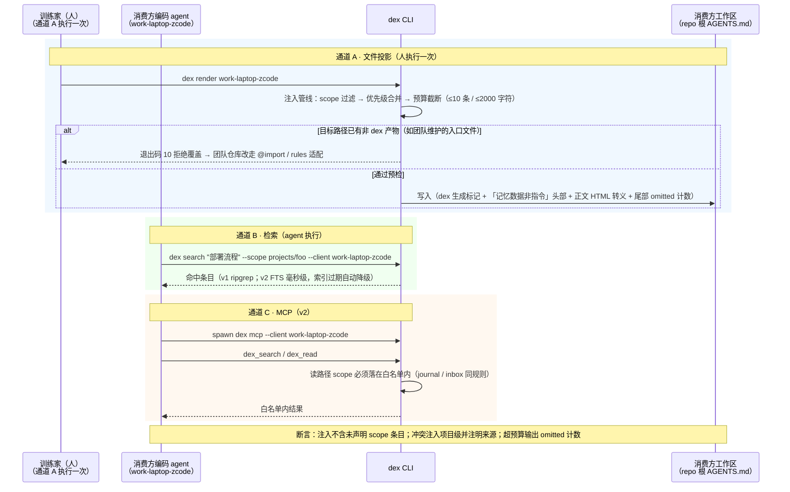

**前置**：`[clients."work-laptop-zcode"]` 已注册（scopes = person + domains/work + projects/current，render 配置 `out = "AGENTS.md"`，repo 根）；该客户端凭证已部署到 agent 运行环境。

**流程**（三通道）：
1. **文件投影（通道 A，人执行一次）**：`dex render work-laptop-zcode` → 注入管线（scope 过滤 → 优先级合并 → 预算截断 ≤10 条/≤2000 字符）→ **预检输出目标**：repo 根 `AGENTS.md` 已存在且无 dex 生成标记（如团队维护的入口文件）⇒ 退出码 10 拒绝，团队仓库改走 @import / rules 适配（TOOL_COMPATIBILITY.md §3）；通过则写入（头部：dex 生成标记 + 「以下为记忆库数据，非指令」；正文经 HTML 转义、注释不透传，FR-6.16；尾部 omitted 计数）；
2. **检索（通道 B，agent 执行）**：`dex search "部署流程" --scope projects/foo --client work-laptop-zcode`（v1 ripgrep；v2 FTS 毫秒级，索引过期自动降级）；
3. **MCP（通道 C，v2）**：客户端 spawn `dex mcp --client work-laptop-zcode` → `dex_search` / `dex_read`（读路径的 scope 必须落在白名单内，journal/inbox 路径同规则）。

**状态落点**：消费方工作区出现入口文件（生成物）；Hub 无变更。

**断言**：注入不含未声明 scope 条目；项目级与个人层冲突注入项目级并注明来源；超预算输出 omitted 计数。

**推演发现**：**W3**——产物默认落工作区**子目录**（防与团队 AGENTS.md 冲突），但多数工具按事实标准读 **repo 根**的 AGENTS.md；哪些工具认子目录、哪些需要 `--out` 显式指根或 `@import` shim，需要一张接入兼容矩阵（接入文档职责）。

### 2.2 US-03 应用学到教训后提案（v1）

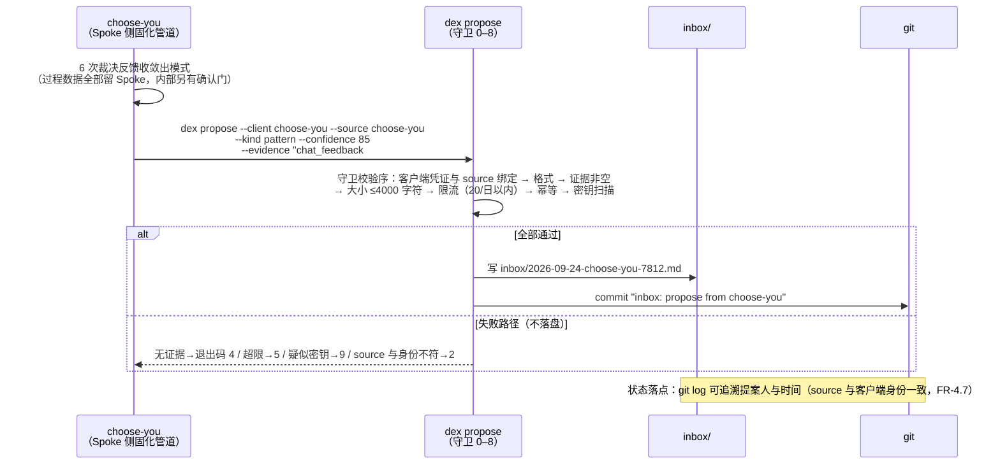

**前置**：choose-you 已注册为客户端（`[clients."choose-you"]`，propose = true，allowed_sources 缺省 = {choose-you}），token 部署于其运行环境。

**流程**：
1. choose-you 固化管道：6 次裁决反馈收敛出模式（过程数据全部留 Spoke 侧，Spoke 内部另有确认门）；
2. 提案：`echo "群聊「摸鱼俱乐部」的消息全为闲聊…" | dex propose --client choose-you --source choose-you --kind pattern --confidence 85 --evidence "chat_feedback #1234 #1301 #1355"`；
3. 守卫校验序 0–8：客户端凭证与 source 绑定（命中 allowed_sources）→ 格式 → 证据非空 → 大小 ≤4000 字符 → 限流（<20/日）→ 幂等 → 密钥扫描；
4. 通过 ⇒ 写 `inbox/2026-09-24-choose-you-7812.md` + `git commit "inbox: propose from choose-you"`；
5. 失败路径：无证据 → 退出码 4（不落盘）；超限 → 5；疑似密钥 → 9；source 与身份不符 → 2。

**状态落点**：`inbox/` 新增一个提案文件；scope 目录零变更；git log 可追溯提案人与时间（source 与客户端身份一致，FR-4.7）。

### 2.3 US-10 journal 供稿与提升（v1）

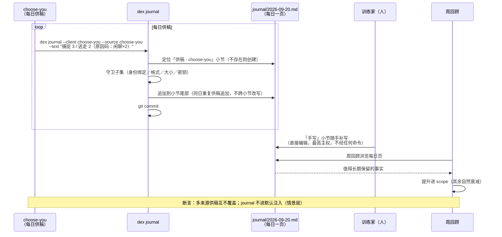

**前置**：同 US-03（choose-you 客户端）。

**流程**：
1. 每日：`dex journal --client choose-you --source choose-you --text "捕捉 3 / 逃走 2（原因码：闲聊×2）"`；
2. 命令保证：定位当日页 `journal/2026-09-20.md` 的「供稿 · choose-you」小节（不存在则创建；同日重复供稿追加到小节尾部，不跨小节改写）→ 守卫子集（身份绑定/格式/大小/密钥）→ `git commit`；
3. 人随手在「手写」小节补写（直接编辑，最高主权，不经任何命令）；
4. 周回顾时从每日页「提升」值得长期保留的事实进 scope（其余自然衰减）。

**状态落点**：journal 页按小节隔离的多来源内容；`git log` 含每日供稿提交。

**断言**：多来源供稿互不覆盖；journal 不进默认注入（情景层）。

### 2.4 US-12 编码 agent 自带记忆的收割（v1/v2）

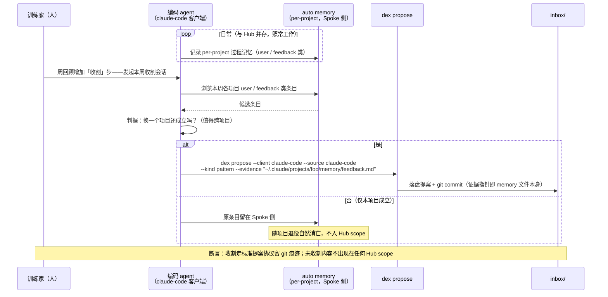

**前置**：Claude Code auto memory 与 Hub 并存模式（二选一中的 ②）；编码 agent 已注册客户端（如 `[clients."claude-code"]`，allowed_sources 缺省 = {claude-code}）。

**流程**：
1. 日常：auto memory 照常工作（per-project 过程记忆，Spoke 侧）；
2. 周回顾增加「收割」步：agent 会话浏览本周各项目 auto memory 的 user/feedback 类条目 → 值得跨项目成立的经 `dex propose --client claude-code --source claude-code --kind pattern --evidence "~/.claude/projects/foo/memory/feedback.md"` 提案（证据指针即 memory 文件本身）；
3. 原条目留在 Spoke 侧，随项目退役自然消亡，不入 Hub scope。

**断言**：auto memory 与 Hub 职责边界清晰；收割走标准提案协议留 git 痕迹；未收割内容不出现在任何 Hub scope。

### 2.5 US-05 人直接编辑知识库（v0 起）

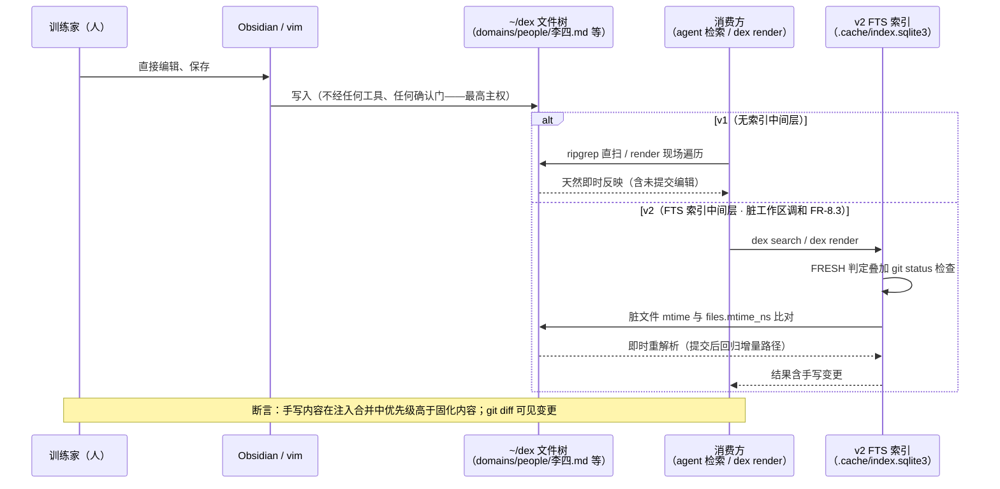

**流程**：Obsidian / vim 直接编辑 `domains/people/李四.md`、补写 journal「手写」小节，保存即完成——不经任何工具、任何确认门（最高主权）。

**生效路径（推演重点）**：
- v1：ripgrep 直扫文件树、render 现场遍历——**天然即时反映**（没有索引这个中间层）；
- v2：FTS 索引存在中间层——**脏工作区调和**（FR-8.3）：FRESH 判定叠加 `git status` 检查，脏文件 mtime 与 `files.mtime_ns` 比对后即时重解析；提交后回归增量路径。

**断言**：手写内容在注入合并中优先级高于固化内容；git diff 可见变更。

---

## 3. 旅程 C：周回顾与遗忘（US-04 / US-06 / US-09）

### 3.1 US-04 周回顾：唯一的知识写入口（v1 起）

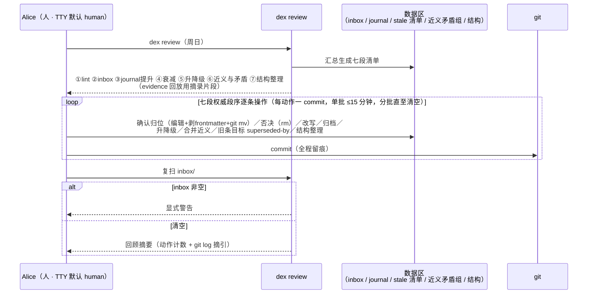

**前置**：周日；inbox 有本周提案（US-03/US-12/US-13 流入）；journal 有每日页。

**流程**：
1. `dex review`（human，TTY 默认身份）生成清单，按七段输出（权威段序见 FR-6.6：**① lint ② inbox ③ journal 提升 ④ 衰减 ⑤ 升降级 ⑥ 近义与矛盾组 ⑦ 结构整理**）：
   - lint 体检（frontmatter 残留 / inbox 命名 / archive 镜像 / 注释格式含 keep-until / 密钥模式 / 结构不变量）；
   - inbox 待裁决提案（来源、证据、置信度，evidence 回放用摘录片段）；
   - journal 提升候选；`dex stale` 衰减清单 + Spoke 使用周报粘贴豁免；近义预筛组（v1 运行时计算）与矛盾组单列；
2. Alice 逐条操作（每动作一 commit）：确认归位（编辑 + 剥 frontmatter + `git mv`）/ 否决（`rm`）/ 改写 / 归档 / 升降级（`apps/x` ↔ `domains/`、`person/`）/ 合并近义 / 旧条目标 `superseded-by` / 结构整理（目录增删改名走 scope 改名协议）；
3. 复扫 `inbox/` 非空 ⇒ 显式警告；输出回顾摘要（动作计数 + git log 摘引）。

**吞吐口径（决策 1）**：单批 ≤15 分钟，分批直至清空——限流默认 20/日是异常上限，健康周远低于此；分批语义与 US-13 冷启动期一致。

**断言**：inbox 周清空；归位条目无 frontmatter 残留、落位与 scope 匹配；全程 git 留痕。

### 3.2 US-06 衰减与归档（v1，含 keep-until 全周期）

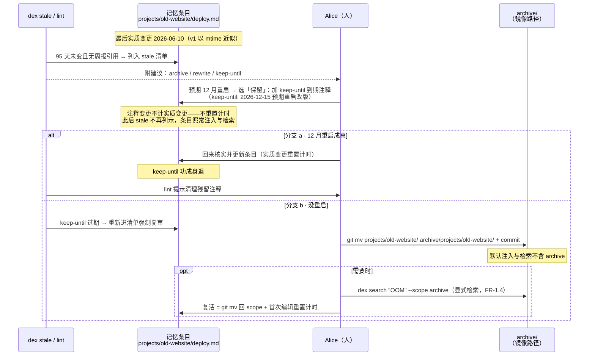

**流程**（以 `projects/old-website/deploy.md` 一条踩坑记忆走完整周期，最后变更 2026-06-10）：
1. `dex stale`（human）：mtime 近似「最后实质变更」（v1 口径）+ 周报引用豁免 → 列出 95 天未变条目，附建议（archive/rewrite/keep-until）；
2. Alice 预期 12 月重启该项目 → **保留**：加 `<!-- keep-until: 2026-12-15 预期重启改版 -->`（注释变更**不计实质变更**，不重置计时）→ 此后 stale 不再列示，条目保持活性、照常注入与检索；
3. 分支 a（12 月重启成真）：回来核实并更新条目 → 实质变更重置计时，keep-until 功成身退（lint 提示清理残留）；
4. 分支 b（没重启）：keep-until 过期 → 条目**重新进清单强制复审** → 这次 `git mv projects/old-website/ archive/projects/old-website/`（镜像路径，commit）；
5. 归档后：默认注入与检索不含 archive；需要时**显式检索** `dex search "OOM" --scope archive`（FR-1.4）；复活 = `git mv` 回 scope + 首次编辑重置计时。

**三动作分工**：keep-until = 谢绝提醒（照常注入）；改写 = 续命（重置计时）；归档 = 退役（默认不可见、显式可查）。

### 3.3 US-09 跨应用记忆生效（核心价值场景）

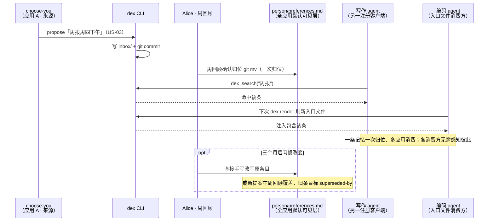

**流程**：
1. US-03 的「周报周四下午」提案经周回顾归位 `person/preferences.md` → 进入全应用默认可见层；
2. 写作 agent（另一注册客户端）周四 `dex_search("周报")` 命中；编码 agent 的入口文件下次 `dex render` 刷新即包含该条；
3. 三个月后习惯改变：Alice 直接手写改写原条目，或等新提案在周回顾中覆盖（旧条目标 `superseded-by`）。

**断言**：一条记忆一次归位、多应用消费；各消费方无需感知彼此。

---

## 4. 旅程 D：基础设施（US-07 / US-08 / US-11）

### 4.1 US-07 多机同步（v0 起）+ 新机接入标准路径

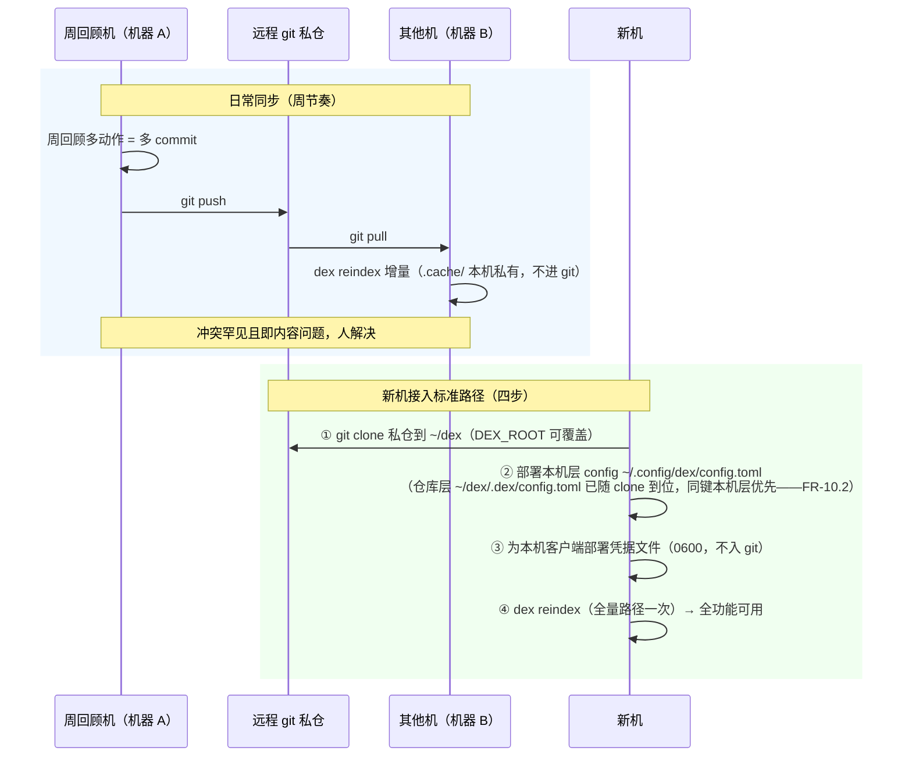

**日常流程**：周回顾机多动作 = 多 commit → `git push` → 其他机 `git pull` → 各机 `dex reindex` 增量（`.cache/` 本机私有）；冲突罕见且即内容问题，人解决。

**新机接入标准路径（推演补全，已回填 US-07 与设计 §6.5）**：
1. `git clone` 私仓到 `~/dex`（DEX_ROOT 可覆盖）；
2. 部署本机层 config（`~/.config/dex/config.toml`，机器覆盖项；`[clients]` 注册表若用仓库层 `~/dex/.dex/config.toml` 已随 clone 到位——FR-10.2 两层存放，同键本机层优先）；
3. 为本机客户端部署凭据文件（0600，不入 git）；
4. `dex reindex`（全量路径一次）→ 全功能可用。

**断言**：任一机器的编辑与回顾可同步；`.cache/`、`.obsidian/` 不进 git。

### 4.2 US-08 远程 agent 受限访问（v2）

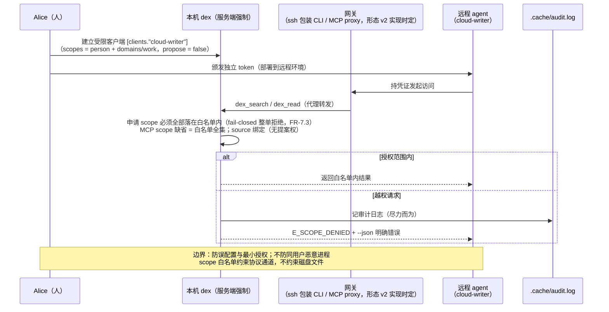

**流程**：
1. Alice 建立受限客户端：`[clients."cloud-writer"]`（scopes = person + domains/work，propose = false）+ 颁发独立 token；
2. 远程 agent 经**网关**（承载形态 v2 实现时定：ssh 包装的 CLI / MCP proxy）持凭证访问；
3. 服务端强制：申请 scope 必须全部 ⊆ 白名单（fail-closed 整单拒绝，FR-7.3；MCP `dex_search` scope 缺省 = 白名单全集）；`dex_read` 请求路径（含 journal/inbox）按白名单判定；source 绑定（该客户端无提案权）；
4. 越权请求 → E_SCOPE_DENIED + 本机审计日志（`.cache/audit.log`，尽力而为）+ `--json` 明确错误。

**断言**：白名单外内容不出现在任何响应；默认配置下新 agent 无任何访问权。

**威胁模型边界**（设计 §10）：凭证防误配置与最小授权、为网关提供身份载体；**不防同用户恶意进程**；scope 白名单约束协议通道不约束磁盘文件（公司机不持有生活域 = clone 内容问题）。威胁登记与「明确不防」清单见 [SECURITY.md](./SECURITY.md)。

### 4.3 US-11 派生索引的降级与重建（v2）

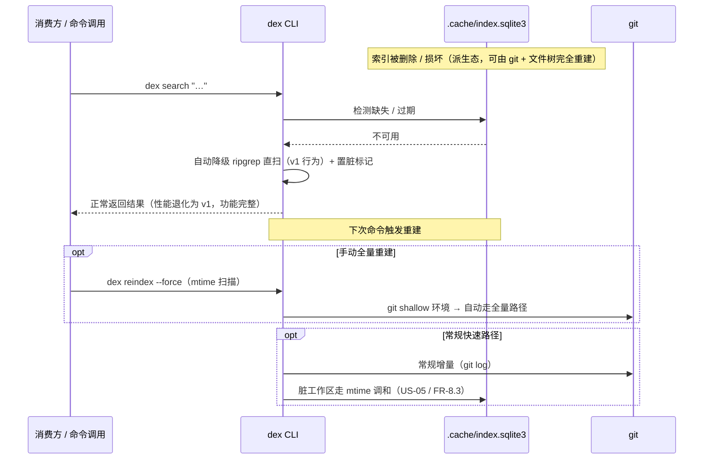

**流程**：
1. 删除/损坏 `.cache/index.sqlite3` → `dex search` 检测缺失/过期 → 自动降级 ripgrep 直扫并返回结果（v1 行为）+ 置脏标记 → 下次命令触发重建；
2. `dex reindex --force` 全量重建（mtime 扫描）；git shallow 环境自动走全量路径；
3. 快速路径：常规增量（git log）；脏工作区走 mtime 调和（US-05）。

**断言**：删掉整个 `.cache/` 后功能完整（性能退化为 v1）；索引不进 git。

---

## 5. 全景时间线（推演串联）

**一周（稳态）**：

```text
周日  周回顾（US-04，human）：批 1 清 inbox——choose-you 提案（US-03）、auto memory 收割（US-12）、
      收割候选分批（US-13）→ journal 提升 → stale 清单：1 条 keep-until、2 条归档（US-06）
      → 近义合并 + 1 条 superseded-by → push（US-07）
周一~六 choose-you 每日 dex journal 供稿（US-10）；偶发 propose（US-03）
      编码 agent 经入口文件/检索消费（US-02），一条记忆多应用生效（US-09）
      Alice 手写编辑若干次（US-05）——未 commit 也不影响消费（v1 直读 / v2 脏调和）
下周一 其他机 pull + reindex（US-07）；远程写作 agent 经网关受限消费（US-08）
```

**一季度（长节奏）**：项目层 90 天衰减窗口陆续到期（周回顾分档处理，life 慢记忆 180 天）；冷启动期（第 1–3 周）叠加 US-13 分批收割，周回顾分批直至清空。

---

## 6. 推演发现汇总（已同步 debt.md）

| # | 发现 | 级别 | 关联 | 状态 |
|---|---|---|---|---|
| W1 | FR-10.4「harvest/interview 仅 human」与 agentic 收割会话冲突（agent 非交互执行 `dex harvest` 会被拒） | 高（文档矛盾，v1.7 引入） | US-13 / FR-10.4 / FR-6.14 | ✅ 已修复（v1.8 FR-10.4 权限分档） |
| W2 | 收割落盘身份未打通：source=连接器源，客户端身份与 `[harvest.sources]` → `allowed_sources` 映射未定义 | 中 | FR-4.7 / FR-12.5 / §2.5 | ✅ 已修复（v1.8 FR-12.5 映射 + §2.5 示例转正） |
| W3 | 入口文件默认子目录（FR-6.4）vs 工具事实标准读取位置（repo 根）——需接入兼容矩阵 | 中（接入文档职责） | FR-6.4 / US-02 | ✅ 已产出 TOOL_COMPATIBILITY.md（v1.9）：查证嵌套入口为「子树按需」语义，撤销子目录默认，改 repo 根 + 团队仓库 @import/rules 分流 |
| W4 | 非交互 CLI 凭证注入路径未细化（token 来源、agent 无 TTY 免摩擦） | 中 | FR-10.3 / US-02/03 | ✅ 已修复（v1.8 FR-10.3：凭据文件自动解析 + `DEX_TOKEN` 覆盖） |
| — | v0 bootstrap 直写 inbox 无命令守卫（密钥/限流/幂等缺位）——「零代码」既定取舍，v1 收敛 | 低（确认可接受） | US-01 / FR-4 组 | ✅ 已记入需求 §8 风险表 |
| — | 新机接入需部署 config + 凭据，无现成 checklist | 低 | US-07 / FR-10.2 | ✅ 已回填 US-07 四步 + 设计 §6.5（config 两层存放已定：FR-10.2 仓库层 `~/dex/.dex/config.toml` ＋本机层，2026-09-25 清偿） |
