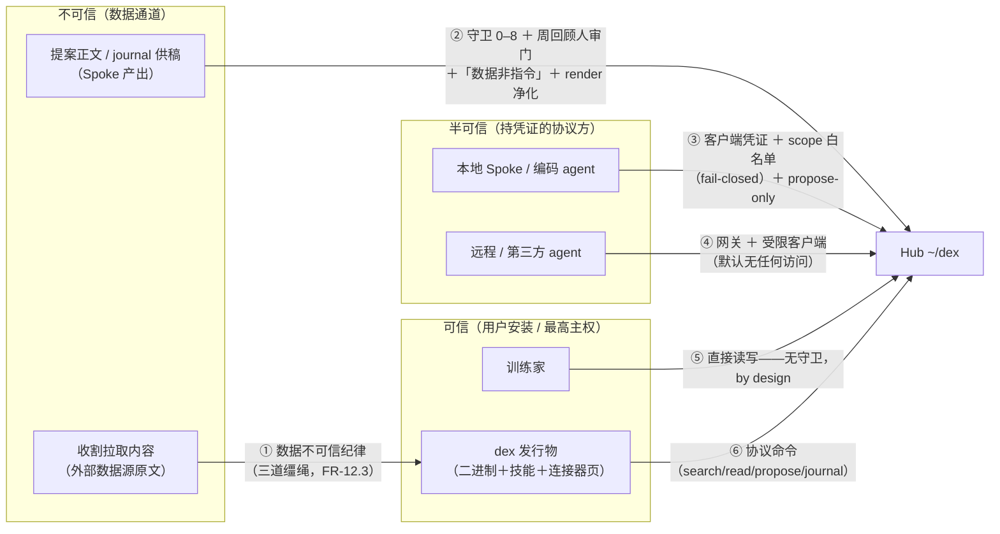

# 安全设计：威胁模型与缓解登记（SECURITY）

> 项目：pokemon-remember-you（就记得是你）
> 文档版本：v1.3 · 2026-09-25 · 状态：待评审（v1.3：可信通道声明技能清单补 `repo-knowledge`（需求 v1.17：FR-11.2 四技能同步）；v1.2：外源索引威胁登记——新增 T17（scope 标签错配越权可见）与 T18（外源内容注入——不可信数据通道延伸至检索/回读面），映射需求 FR-8.5–8.8/§8 风险表、设计 §4.3/§10（需求/设计 v1.16 同步，含隔离 sdd-reviewer 评审清偿）；v1.1：实施前评审修订——§2 边界⑤补 TTY human 免凭证对齐（FR-10.3 同口径）、§6 审计日志轮转默认定 1 MiB、§8 补 import 片段模式净化豁免登记；v1.0：初版——安全专项补充：§1–§4 将散落于需求 NFR-8/FR-4.6/4.7/FR-10 组、设计 §5.5/§8/§10、提案 §九/§十一 的安全条目收编为统一威胁登记；§5–§9 补五处缺口——凭证生命周期（FR-10.5）、守卫审计日志（FR-10.6）、授权配置变更提示（FR-10.7）、render 输出净化（FR-6.16）、发行物完整性（FR-11.7）；需求/设计同步 v1.13）
> 上游文档：[REQUIREMENTS.md](./REQUIREMENTS.md)（NFR-8、FR-10 组）· [DESIGN.md](./DESIGN.md)（§5.5 校验序、§8.3/8.4 退出码与枚举、§10）· [PERSONAL_MEMORY_HUB_PROPOSAL.md](./PERSONAL_MEMORY_HUB_PROPOSAL.md)（§九、§十一）
> 定位：**安全侧单一权威源**——威胁枚举、缓解映射、「明确不防」与剩余风险登记以本文为准；需求 NFR-8 与设计 §10 引用本文。机制类条目（FR/设计节）以对应文档为权威，本文做展开与论证。发现新威胁随时登记，缓解落地后更新状态列。

---

## 1. 资产清单

| 资产 | 敏感度 | 泄漏/损失后果 |
|---|---|---|
| 记忆数据（`~/dex` 文件树：人物页、健康模式、个人事实等） | 高 | 泄漏 = 个人隐私暴露；被篡改 = 污染所有消费方上下文 |
| git 历史（永久留痕——否决/归档内容仍在） | 高 | 脱敏负担：入库即永驻（提案 §九「双刃」） |
| 客户端凭证（本机凭据文件、`DEX_TOKEN`） | 高 | 持有者获得该客户端全部授权（含远程网关身份） |
| 授权配置（仓库层 `[clients]` 注册表，随 clone/pull 同步） | 高 | 被篡改 = 自我扩权（T6） |
| 入口文件 / render 产物（写消费方工作区） | 中 | 注入主动内容 = 影响所有消费 agent（T7） |
| 技能与连接器页（`skills/`，行为通道） | 高（完整性） | 投毒 = 以用户身份行事（T8/T14） |
| dex 发行物（二进制 + 内嵌技能） | 高（完整性） | 供应链根——替换即完全控制（T8） |
| 审计日志（`.cache/audit.log`） | 低 | 丢失 = 协议面拒绝事件不可追溯（尽力而为定位） |
| 派生索引（`.cache/` 全部） | 低 | 可重建，无正确性影响（NFR-4） |
| 远端 git 私仓 | 高 | 泄漏 = 全库暴露（T9） |

## 2. 信任边界

边界要点：① 收割内容永远当数据不当指令（蒸馏在技能侧、人审在环）；② 提案是数据非指令——守卫、人审、声明、净化四层纵深；③④ 协议通道强制身份与白名单，本地与远程同规则；⑤ 人的直接编辑不经任何守卫——写入主权分级的刻意设计，「人的操作」即信任根（同一原则延伸：TTY 交互式终端解析为 human 客户端且免凭证——物理在场即信任根，FR-10.3；非交互调用一律凭证）；⑥ 技能/连接器页/二进制是**行为通道**（定义 agent 怎么做），与记忆数据（不可信通道）分离——行为通道的可信前提是用户从可信源安装（T8）。

## 3. 威胁登记表

> 状态标记：✅ 已闭环 ｜ 🆕 本次补缺口（FR 已落）｜ 📄 纪律面（文档约束 + 人审，无机械防御）｜ ⛔ 明确不防（§4）。

| # | 威胁 | 通道与前提 | 缓解 | 状态与剩余风险 |
|---|---|---|---|---|
| T1 | 记忆投毒 / 内容注入（提案正文携指令，归位后随注入扩散到所有消费方；MINJA / AgentPoison 类） | propose → 周回顾归位 → render/检索注入；journal 供稿→周回顾提升为同型路径（防御相同） | 周回顾人审确认门（第一道）；render 产物「数据非指令」声明（FR-6.4）；密钥扫描（FR-4.6）；矛盾显式化 superseded-by（FR-2.5）；render HTML 净化（FR-6.16 🆕） | 📄+🆕 语义级注入不可机械过滤，人审为主防线（设计 §13 已记录残留风险）；净化补渲染层（T7），非语义层——人审是 **propose 通道**的第一道防线，git 直写通道见 T16 |
| T2 | 越权读（scope 逃逸、路径穿越 `..`、symlink 逃逸、禁区路径） | CLI / MCP | fail-closed 整单拒绝（FR-7.3）；路径安全退出码 6（设计 §10）；未注册全拒（FR-10.3）；安全用例（设计 §12） | ✅ 同机文件明文归 T12 |
| T3 | 伪报 source 绕限流 / 伪造审计 | propose / journal | source 强制绑定客户端 allowed_sources（FR-4.7，E_SOURCE_MISMATCH） | ✅ |
| T4 | 提案洪水灌满 inbox | propose | 证据必填 ＋ 正文/evidence 上限 ＋ 单 source 日限流 ＋ 内容 hash 幂等（FR-4.2/4.3，设计 §5.5） | ✅ 定位**防异常非防恶意**：限流按 inbox 文件名日期计数，改系统时钟可绕——同用户边界内（T12），接受；时钟防篡改不设目标 |
| T5 | 凭证泄漏 / 存储过宽 / 无法吊销 | 本机凭据文件、`DEX_TOKEN`、远程环境部署 | 0600、不入 git、命令行不明文传 token（FR-10.2/10.3） | 🆕 生命周期补全（FR-10.5，§5）：权限自检警告、轮换、吊销语义、生成熵与格式 |
| T6 | 授权配置被篡改（远端私仓被攻破或恶意机器 push，经仓库层 `[clients]` 自我扩权——config 随 pull 同步，FR-10.2 的多机一致性特性同时是攻击面） | git 远端 → pull | 私仓 ACL；凭证永不进仓库层（FR-10.2） | 🆕 变更提示 W_CONFIG_CHANGED（FR-10.7，§9）给可见性；彻底防御靠 pull diff 审视（人责，纪律面）；同前提下的 scope 内容直写面见 T16 |
| T7 | 入口文件承载主动内容（条目正文 HTML/script 经 render 进入口文件，Obsidian/网页渲染类消费方执行） | render 产物 | 「数据非指令」头部声明（文本级） | 🆕 HTML 转义 ＋ 注释不透传（FR-6.16，§8）；markdown 链接 scheme 不做白名单（消费方为 agent 纯文本上下文与人用编辑器，执行面有限——登记接受，渲染类消费方出现实际案例再加） |
| T8 | 供应链投毒（dex 二进制 / 内嵌技能 / `--from` 工作副本被替换） | 发行物安装 | ——（本次识别的缺口） | 🆕 checksums ＋ 校验文档 ＋ 可信通道前提声明（FR-11.7，§7）；签名体系不引入（§7 取舍登记） |
| T9 | 远端私仓泄漏（平台账号被攻破 / 仓库误开公开） | git 同步 | 私仓纪律；敏感内容不入库（WORK_LIFE_SCENARIOS §5 反推荐清单）；git-crypt 可选 | 📄 git-crypt 与 NFR-6「10 年无工具可读」冲突（密钥依赖）——推荐序见 §7「git-crypt 取舍」 |
| T10 | 协议面拒绝事件不可追溯（git 只记写动作，拒绝不留痕） | CLI / MCP 守卫 | —— | 🆕 audit.log 规格（FR-10.6，§6）：字段/脱敏/轮转；尽力而为定位不变 |
| T11 | 并发竞态（git index.lock、SQLite 并发写） | 同机多 dex 进程 | busy_timeout ＋ 退避重试 ＋ 幂等（设计 §4.2/§5.5） | ✅ |
| T12 | 同用户恶意进程（读 token / 读写文件树 / 环境变量窥探） | 本机任意进程 | —— | ⛔ 明确不防（设计 §10 既定边界：token 本地可读、文件树明文，后者物理不可防）——§4 |
| T13 | 物理访问 / 整机失窃 | 磁盘 | —— | ⛔ 明确不防——交 OS 层：建议启用磁盘加密（FileVault / BitLocker / LUKS）；dex 不自带应用层加密（§4） |
| T14 | 收割会话内即时注入（拉取内容当场指挥 agent，不经 Hub） | 收割会话 | 数据不可信纪律（三道缰绳之一，FR-12.3）；连接器页属可信通道（FR-11.7 声明） | 📄 技能纪律面：dex 不观测会话内容（FR-6.14 既定取舍）；连接器页被投毒 = 供应链问题归 T8 |
| T15 | MCP 服务面暴露 | dex mcp stdio | 无网络监听端口；四工具收缩语义面；身份来自 spawn 参数不自报 clientInfo（设计 §8.2/§13） | ✅ |
| T16 | Hub 内容完整性：scope 内容经远端/他机 git 直写（不经 propose、绕过周回顾人审门），随 pull 扩散到各机的注入与检索——与 T1 等价后果、不同通道 | git 远端或他机 → push → 其他机 pull | 私仓 ACL；git 历史全程留痕（事后可定位与回滚）；pull diff 审视纪律（人责，纪律面） | 📄 周回顾人审门只覆盖 propose 通道（T1）；git 通道的内容变更无机械门禁，可见性靠人的 pull diff 审视——完整表述应为「人审是 propose 通道的第一道防线」。可选增强（未来评估、暂不设 FR）：`dex review` 增列「非本机作者/近期 pull 引入的 scope 提交」清单 |
| T17 | 外源索引配置错误越权（scope 标签配错域——如机密工作仓被标进宽域，其知识文件内容经检索结果行外泄给未预期客户端；外源索引使外部仓内容进入 dex 检索面） | config `[index.sources]` 注册 → search 检索面（FR-8.5–8.8） | 标签缺省 `projects/<id>` 且枚举域排除 `person` 与恒排除目录（FR-8.6，lint 错误）；命中仍走客户端白名单 fail-closed（FR-8.8/FR-7.3）；外源内容只在检索结果行级出现、不进注入与 `dex read`（FR-8.5）；`path` 仅本机层有效——注册表其余键在仓库层时可审计（W_CONFIG_CHANGED 面，FR-10.7） | 🆕 剩余风险：标签本身配错宽域（如 `domains/…`）属授权最小化纪律（FR-3.7，人责）——可见性问题与 T6 同级，无机械防御 |
| T18 | 外源内容注入（克隆/被投毒的上游 repo 之 AGENTS.md / docs 正文经检索命中行直接进入消费 agent 上下文——不经周回顾人审门、检索输出无「数据非指令」声明承载；按指针回读全文为同型放大） | 外源索引检索面（FR-8.5–8.8） | 注册面信任前提 = 用户自有仓 clone（注册即本人维护的仓）；命中行恒带 `repo:` 来源标注（来源可辨）；遍历尊重源仓 .gitignore、**不跟随 symlink**（防仓外本机文件被索进检索面，FR-8.6）；「拉取内容当数据」纪律（FR-12.3 三道缰绳之一）延伸至检索与回读面——配套技能文档声明 | 🆕 语义级注入不可机械过滤（与 T1 同级残留风险）：外源内容的人审在 repo 侧（用户对所 clone 仓的内容负责，repo 自身 git 历史可审计），dex 不复制、不注入其正文（只在检索结果行级出现） |

## 4. 明确不防清单（边界诚实化）

安全设计必须声明边界，否则给人错误的安全感。以下超出防御目标；出现相关诉求时重新评估本文档：

1. **同用户恶意进程**（T12）：token 与文件树同用户可读——任何本机进程都能冒充。防御在 OS 层（多用户隔离、沙箱），不在 dex。这也是「限流防异常不防恶意」（T4）的原因。
2. **物理访问 / 整机失窃**（T13）：交 OS 磁盘加密（建议启用 FileVault / BitLocker / LUKS）；dex 不自带应用层加密——与 NFR-6 长寿原则冲突。
3. **语义级内容审查**：propose 不做语义判断（人是裁决者，FR-4.6）——「这条内容该不该入库」的判断权在人；机械审查既不可靠也不符合主权模型。
4. **远端平台的账号安全**：私仓 ACL 与平台治理归平台；dex 侧对应物是 T6 可见性提示与 T9 不入库纪律。
5. **计时/侧信道**（token 比较以外）：单机 stdio/CLI 场景无远程计时面；token 比较仍采用恒定时间（§5，成本低顺手做）。

## 5. 凭证生命周期（FR-10.5 展开）

| 阶段 | 规格 |
|---|---|
| 生成 | 随机串 ≥256-bit 熵（如 `openssl rand -base64 32` 产出）；建议带 `dex_` 前缀便于 secret 扫描器识别；一客户端一 token，不复用 |
| 存储 | 本机凭据文件（默认 `~/.config/dex/credentials.toml`，路径经本机层 config 指定，FR-10.2）——0600、永不入 git 与仓库层 config；`DEX_TOKEN` 环境变量仅作运行时覆盖（env 对同用户进程可见——T12 边界内） |
| 校验 | dex 加载凭据文件时检查：① 权限宽于 0600 ⇒ warning W_CREDS_PERMS（不阻断——防意外如复制到共享目录；防恶意归 T12 不设目标）；② token 长度 <32 字符（熵的代理指标，防网关场景弱 token 被爆破）⇒ 该客户端按无凭证处理（全拒）并提示重新生成——一次性成本，本地单机场景重新生成即恢复；③ token 比较恒定时间（黑盒不可测，由代码审查保证）。（0600 为 POSIX 口径；Windows 为可选平台，ACL 等价检查实现时定，NFR-5） |
| 轮换 | 更新本机凭据文件中该客户端的值即完成——token 无状态、无会话、无黑名单，配置即真相；**轮换为单机操作**（各机凭据文件本就独立），要全网失效走吊销 |
| 吊销 | 删除或注释掉 `[clients.<id>]` 条目（注释即禁用）⇒ 该身份未注册全拒（FR-10.3 兜底）；**传播边界**：注册表在本机层时即时生效；在仓库层时随 git 同步、各机（含网关宿主）pull 后生效——泄漏应急时应先在服务侧机器立即 pull 或手动移除，再吊销 + 重发 + 审计日志（§6）回查该客户端近期拒绝记录 |
| 多机 | 凭据文件不随 git 同步——各机另行部署（US-07 步 ③）；泄漏一台只影响一台 |

## 6. 守卫审计日志（FR-10.6 展开）

- **定位**：git commit 已是一切写动作的完整审计流（设计 §10）；本日志只补 git 看不到的**协议面拒绝事件**——追加写 `.cache/audit.log`，尽力而为（写失败不阻断主流程，可随缓存丢失，NFR-4 口径）。
- **记录事件**：越权 scope（E_SCOPE_DENIED）、未注册/无凭证、source 不匹配（E_SOURCE_MISMATCH）、限流（E_RATE_LIMIT）、密钥命中（E_SECRET）、路径非法（E_BAD_PATH）。
- **字段**：UTC ISO-8601 时间｜客户端 id（未注册记 `unknown`）｜命令或工具名｜申请的 scope/路径（写入前剥离换行与控制字符，防日志行伪造）｜结果码。**不记录**：记忆内容本体、evidence、token、环境变量——防日志自身成为二次泄漏面。
- **轮转**：单文件软上限，默认 1 MiB（可配），超限保留尾部（最旧丢弃）。
- **消费**：`dex review` 不默认展示（噪声控制）；泄漏应急与异常排查时人直接读文件。

## 7. 供应链与可信通道（FR-11.7 展开）

**发行物完整性**：每次 release 附 `checksums.txt`（SHA-256，覆盖二进制与内嵌技能物），安装文档给校验命令（如 `shasum -a 256 -c checksums.txt`）。覆盖面：「下载损坏」与「镜像/中转篡改」——前提是校验和取自独立可信渠道；与二进制同页托管的 checksums 对官方渠道自身沦陷无防御（登记接受）。**不引入签名体系**（GPG / sigstore）：单人工具、分发面小；签名引入密钥管理负担且当前无分发渠道背书可验——出现真实需求（如第三方镜像分发）再升级。此为登记过的取舍而非疏漏。

**可信通道声明**：技能（dex-bootstrap / dex-propose / dex-review / repo-knowledge）与连接器页（`skills/connectors/`）定义 agent **行为**，与记忆数据（不可信通道）分离（提案 §七）。其可信前提 = 用户从可信源安装（官方 release 或本人维护的工作副本）；`dex skills install --from` 指向的工作副本若被污染，等价于自行安装恶意软件——安装文档写明该风险自担。连接器页会引导 agent 访问外部数据源，其被投毒的后果归 T8（供应链）而非 T14（数据面）。

**git-crypt 取舍**（T9）：git-crypt 在 worktree 侧透明（编辑器/Obsidian 仍见明文），但密文依赖密钥——与 NFR-6「10 年后无任何本工具也可完整读写」直接冲突（密钥丢失 = 数据永久不可读），且多机都要部署 git-crypt 并管理密钥。推荐序：**敏感不入库（第一）→ 拆独立仓库/独立加密卷（第二）→ git-crypt（最后，明确接受 NFR-6 冲突才用）**。

## 8. render 输出净化（FR-6.16 展开）

- **机制**：注入管线输出前对条目正文做 HTML 转义（`<` `>` `&` → 实体）；src / superseded-by / keep-until 注释**不透传**（FR-3.3 字数口径本就排除注释；来源信息以 render 重新生成的安全标注承载，如行尾来源注）。
- **威胁对应**：T7（渲染类消费方执行主动内容）——「数据非指令」声明是文本级防御，净化是结构级防御，二者叠加；T1 的语义注入**不在此层**（净化不改变语义，人审仍是主防线）。
- **明确不做**：markdown 链接 scheme 白名单（消费方为 agent 纯文本上下文与人用编辑器，执行面有限——登记接受）；markdown 语法本身保留（消费方理解的主要格式）；**import 片段模式不适用净化**（零复制引用原文件，无法逐条转义——残留风险与 DESIGN §13 同源登记，宿主片段层声明注释是该模式唯一文本防御）。

## 9. 授权配置变更提示（FR-10.7 展开）

- **机制**：dex 每次加载仓库层 `~/dex/.dex/config.toml` 时计算内容 SHA-256，与 `.cache/` 内上次记录比对——不一致 ⇒ `W_CONFIG_CHANGED` warning（提示 `git log -p -- .dex/config.toml` 核实授权变更），随后更新基线。
- **威胁对应**：T6——授权配置随 pull 同步是 FR-10.2 的多机一致性特性，同时也是攻击面；本机制把「授权地图变更」变成**显式事件**，剩余防御（确认变更合法）是人的 pull diff 审视纪律。
- **盲区（诚实声明）**：`.cache/` 无基线时（新机 reindex 前、缓存被清）首次加载静默建立基线，检不出「带着恶意 config 上线」；提示对合法编辑同样触发（低频，噪声可接受）。

## 10. 文档映射

| 本文章节 | 需求落点 | 设计落点 |
|---|---|---|
| §3 T1 | FR-4.6、FR-6.4、FR-2.5、FR-6.16 | §5.5-8、§6.2、§13 |
| §3 T2/T15 | FR-7.3、FR-10.3、NFR-8 | §8.2、§10、§12 安全用例 |
| §3 T3/T4 | FR-4.7、FR-4.2/4.3 | §5.5 |
| §5 凭证生命周期 | FR-10.5 | §10（凭证生命周期行）、§8.4（W_CREDS_PERMS） |
| §6 审计日志 | FR-10.6 | §10（审计行） |
| §7 供应链 | FR-11.7、§8 风险表 | §10（供应链行） |
| §8 render 净化 | FR-6.16、§6 v1 验收 | §10（渲染层净化行）、§12 |
| §3 T16（内容直写投毒） | §8 风险表（远端私仓行） | §10（威胁模型边界行）；可选增强候选（dex review 增列非本机 scope 提交） |
| §9 变更提示 | FR-10.7 | §8.4（W_CONFIG_CHANGED）、§10（授权配置完整性行） |
| §3 T17（外源索引越权） | FR-8.5–8.8、§8 风险表（外源索引配置错误行） | §4.3、§10（外源索引行）、§12（外源索引用例行） |
| §3 T18（外源内容注入） | FR-8.6（遍历纪律）、§8 风险表（外源内容注入行） | §4.3（遍历纪律注）、§10（外源索引行）、§12（外源索引用例行） |
